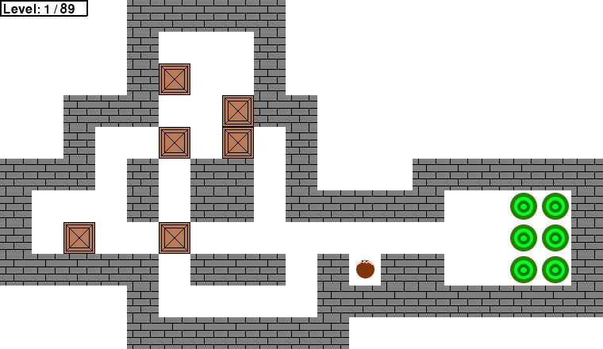

# Sokoban clone

This game is a clone of Sokoban developed for the [Programming Fundamentals](https://sigarra.up.pt/feup/en/ucurr_geral.ficha_uc_view?pv_ocorrencia_id=419983) course, from FEUP.

The game was developed in PyGame. The levels used are from [XSokoban](http://www.cs.cornell.edu/andru/xsokoban.html).



* [Video here](https://www.youtube.com/watch?v=lyPP9xS6Q_M)

## Prerequisites

PyGame installed

Try one of the following commands under the anaconda prompt or terminal:

```
pip install pygame

sudo apt-get install python3-pygame

```

## How to Run

 Directly from your Python interpreter, run the file "Sokoban.py".

## Built With

* [Python] - Programming Language used
* [PyGame] - Module used

## Authors

* **Teresa Corado** - *Main work* - up201806479 - up201806479@fe.up.pt

## Acknowledgments

* **Ricardo Cruz** - *Supervisor* - rpcruz - rpcruz@fe.up.pt

